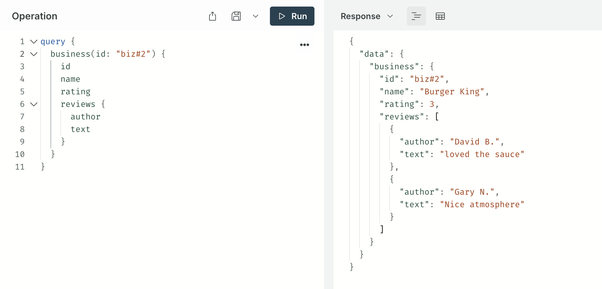

# Strawberry GraphQL Federation Playground

Useful for understanding how Federation directives work and subgraph schemas interact with each other in a minimal setting.

Clone this repo and make changes to **instantly** see results, letting you rapidly iterate on federated schema design.

⚡ **Instantly** see results and any composition errors that may occur\
✨ **Runs locally** on your laptop with minimal dependencies\
🐛 **Great for debugging** and sharing minimal reproductions

## Usage

- This is intended to be run locally on your **laptop**.
- Clone locally and make your changes to `subgraph_business.py` and `subgraph_review.py` (feel free to rename)!
- Ensure you have [**poetry**](https://python-poetry.org/) installed.
- Ensure you have [**rover**](https://www.apollographql.com/docs/rover/getting-started) installed.
- Ensure you have [accepted the Rover ELv2 license](#rover-prompts-you-to-accept-the-terms-and-conditions-of-the-elv2-license).

**Instructions**

```bash
$ git clone git@github.com:magicmark/strawberry-federation-playground.git
$ cd strawberry-federation-playground
$ poetry install
$ make start # (or `poetry run supervisord`)
```

⚠️ If you're on a corporate VPN that intercepts DNS you may need to temporarily disconnect for `poetry install` to work.

### Playground

Once started up, you can access the playground here:

✨ [`http://localhost:4000/`](http://localhost:4000/) ✨



Copy and paste the above query to try it out:

```graphql
query {
  business(id: "biz#2") {
    id
    name
    rating
    reviews {
      author
      text
    }
  }
}
```

- Make your changes to `subgraph_business.py` and `subgraph_review.py` and save to see results!
- The schema will hot-reload on save, you don't need to restart the server.
- Feel free to rename the subgraphs to more closely resemble your actual use case, or even add another subgraph
    - (You will need to make the corresponding changes in `supergraph.yaml` and `supervisord.conf`)

## Keep it minimal

If you're using this to learn how directives work in practice, or share a minimal reproduction, I highly encourage you
to **start from scratch** and write the most minimal schema possible that still has the relationships and directive
usage that you need. Use `Foo` and `Bar` naming instead of `MyObscureFeatureWithLongTypeName`. (Then you can build up in
here to the full schema if neccessary.)

See more: https://stackoverflow.com/help/minimal-reproducible-example

## FAQs / Errors

### Rover prompts you to accept the terms and conditions of the ELv2 license.

See https://www.apollographql.com/docs/rover/commands/supergraphs#federation-2-elv2-license

You can run this magic command to trigger the license accept prompt:

```bash
rover dev --name foo --schema foo.graphql --url http://foo
```

### `cannot bind the router` startup error

If you're seeing something like:

```
error: You cannot bind the router to '127.0.0.1:4000' because that address is already in use by another process on this machine.
        Try setting a different port for the router to bind to with the `--supergraph-port` argument, or shut down the process bound to '127.0.0.1:4000'.
```

Try killing the stuck process by finding which port is bound to `4000` and killing it:

```
$ lsof -i ':4000'
COMMAND     PID  USER   FD   TYPE             DEVICE SIZE/OFF NODE NAME
router-v1 79771 markl    9u  IPv4 0x95804be4aa9295da      0t0  TCP localhost (LISTEN)

$ kill -9 79771
```

### `--url <SUBGRAPH_URL> is required when not attached to a TTY`

If you're seeing something like:

```
rover      | error: --url <SUBGRAPH_URL> is required when not attached to a TTY
```

Check `ps aux | grep router` and `kill -9` the old process.

## Disclaimers

This is not an official Strawberry or Apollo product, i'm just a fan :)
